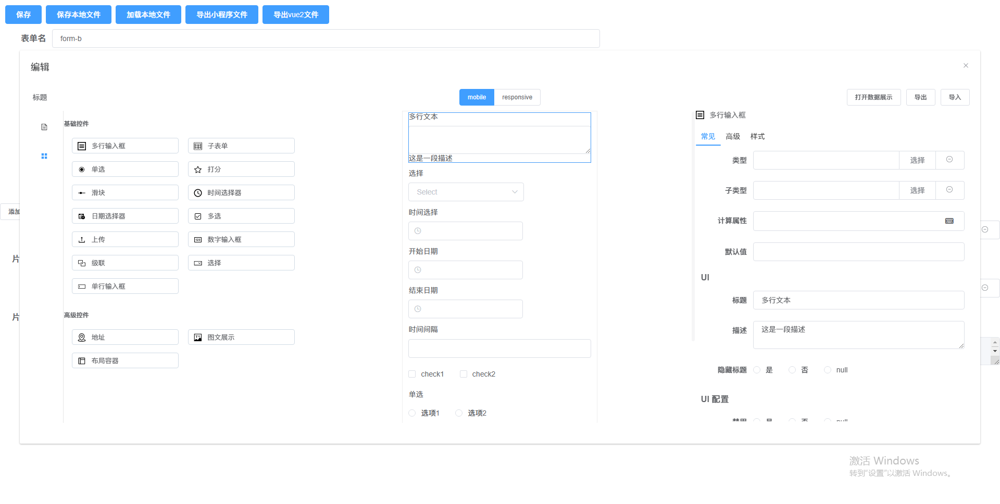

# vite_vue3_admin

## 目录简介

1. [介绍](#介绍)
2. [业务开发](#业务开发)
    - [启动服务](#启动服务)
3. [编译原理](#编译原理) 
    - [基础组件](#基础组件)
   
## <a name="介绍">介绍</a>
1. 提供一个给用户UI拖拽和配置 生成可以在vue2 小程序上跑的程序




## <a name="业务开发">业务开发</a>
### <a name="启动服务">启动服务</a>

```bash
npm run gongsi
```


## <a name="编译原理">编译原理</a>
### <a name="基础组件">基础组件</a>

1. CusInput 输入框
2. CusTextarea 多行文本
3. CusSelect 选择
